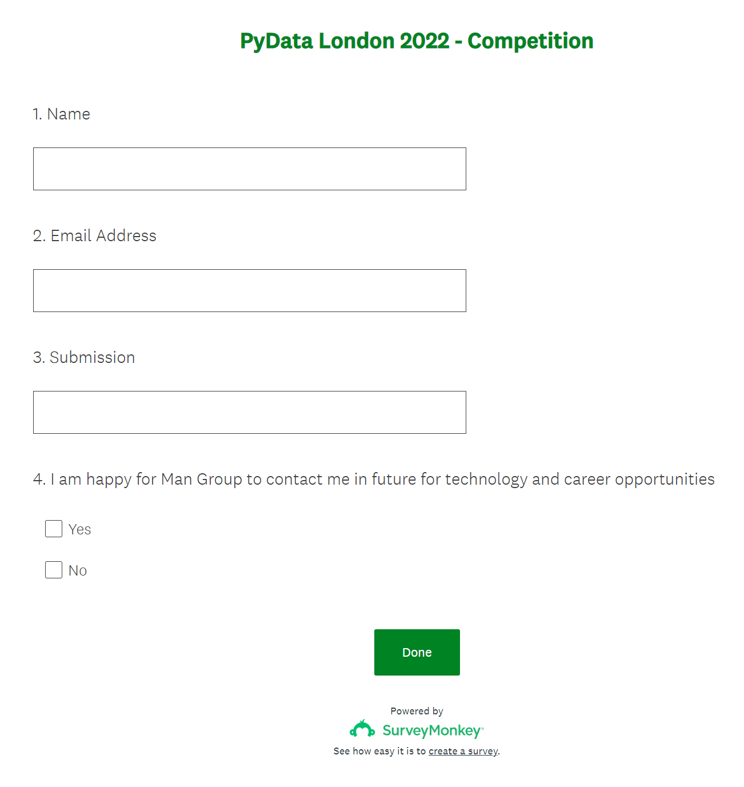

# Pydata-London 2022

## Jupyter Notebook Plotting Competition 

For this competition, we are calling on bright minds from the PyData2022 event to showcase their skills and develop a visualization for option chain data.

What is option chain data?

https://www.investopedia.com/terms/o/optionchain.asp#:~:text=An%20options%20chain%2C%20also%20known,within%20a%20given%20maturity%20period.


### Submit your notebook before 3pm on Sunday 19th June 2022 and win a set of [Sony WF-1000XM3 wireless noise-cancelling headphones](https://www.sony.com/ke/electronics/truly-wireless/wf-1000xm3). Come to the Man Group booth at 4pm for the announcement. We'll also invite the winner to tour our office in London :)


What good is data without a plot to tell the story?

### How to load option chain data?

```bash
git clone https://github.com/man-group/pydata2022.git
cd pydata2022
python
```

```python
import pandas as pd

df = pd.read_parquet("./option_chain_data.parquet")
```

### How to submit my work?

1. Upload your Notebook to a publicly-available github repo.
2. Copy the url to your Notebook
3. Provide details:

https://www.surveymonkey.co.uk/r/N67PXD9




